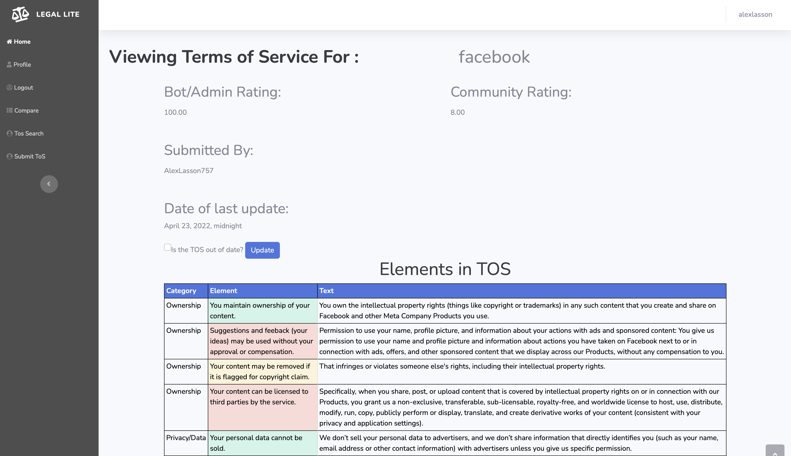
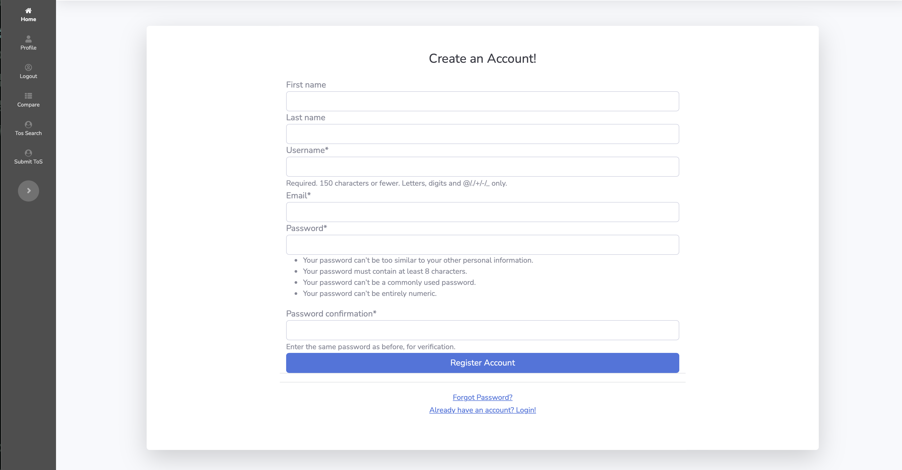
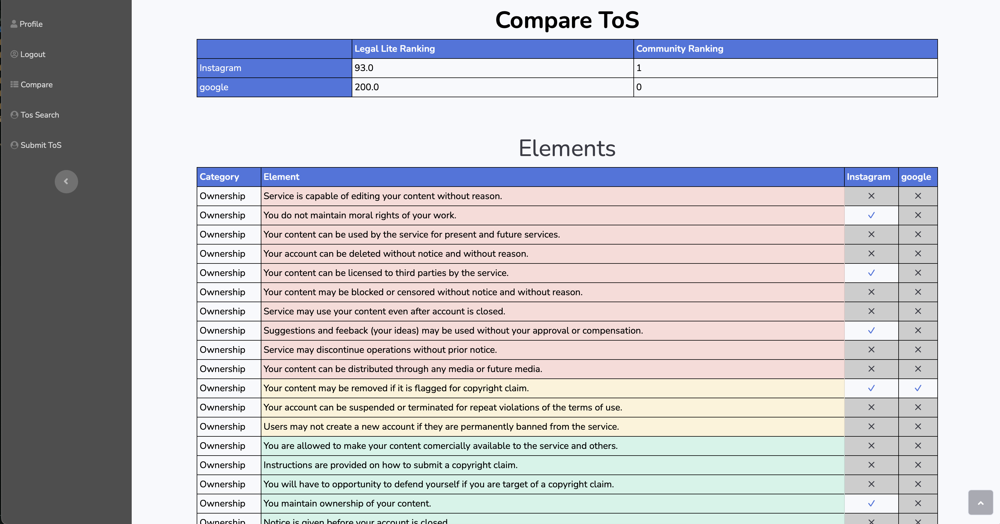
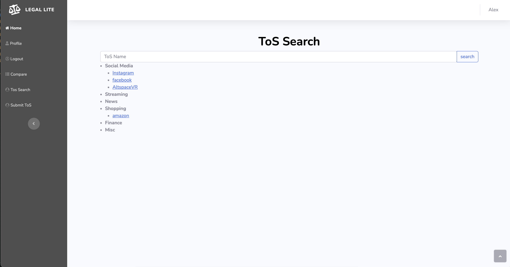

legalite

Overview

The legality program is a Django-based application designed to analyze and evaluate Terms of Service (TOS) agreements. It provides users with a comprehensive assessment of the legitimacy of TOS agreements, assigning them a score and color-coding (red, green, or yellow) based on their level of clarity.

Features

Legitimacy Scoring: The program employs an algorithm to evaluate the legitimacy of TOS agreements. The resulting score determines the color-coded rating (red, green, or yellow) displayed to users.
User Contributions: Registered users can contribute to the platform by submitting new TOS agreements. Each submission undergoes a legitimacy assessment and is added to the database.
Comparison Tool: Users can compare multiple TOS agreements to identify differences and similarities, aiding in decision-making.
User Profiles: Registered users have access to a profile page where they can view and edit their information. The profile also displays TOS agreements and edits contributed by the user.
Community Ranking: Users can provide community rankings for TOS agreements, contributing to the overall legitimacy score.

Implemented features such as user registration, profile management, TOS submission, comparison, and search functionality. Integrated spaCy for automated annotation of TOS submissions, enhancing the efficiency of identifying specific legal clauses. Utilized Django forms for user interactions, enabling users to submit, edit, and compare TOS agreements. Implemented a community ranking system for TOS submissions, allowing users to rate and contribute to the ranking of TOS agreements. Ensured a user experience with responsive and interactive web pages.

